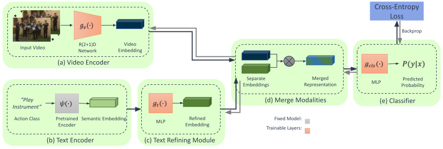

# Reformulating Zero-shot Action Recognition for Multi-label Actions

by
Alec Kerrigan,
Kevin Duarte,
Yogesh Rawat,
Mubarak Shah

This paper has been submitted for publication in NeurIPS 2021

A reformulation of zero-shot action recognition away from nearest neighbor search, using a learned pairwise scoring function. We set the state of the art for single label classification on UCF101 and HMDB, as well as set a baseline for multi-label.

*System Architecture*

## Software implementation

This repository provices the nessesary code to replicate results from the above papers 

## Dependencies

All depedencices exist within the conda environment, and can be installed by

    conda env create -f environment.yml

## Instructions

Before running any code you must activate the conda environment:

    source activate zsar

All setup is done inside of [config.py](config.py)

In particular, be sure to set the correct folder for your copies of UCF101 and HDMB. Kinetics requires a metadata file with the list of videos and classes. An example can be found at [kineticssmall.txt](kineticssmall.txt)

If you would like to use Weights&Biases, be sure to set *opt.wandb* to true, and set your username inside of [main.py](main.py)

Here are setups to replicate results from relevent papers

### Reformulating Zero-shot Action Recognition for Multi-label Actions

    opt.size = 112
    opt.clip_len = 16
    opt.class_overlap = 0.05
    opt.n_epochs = 50
    opt.lr = 1e-3
    opt.step_size = 20
    opt.dataset = 'kinetics'
    opt.valset1 = 'ucf101'
    opt.valset2 = 'hmdb51'
    opt.traintype = 'ce'

## Credits

We adapt code (particularly the dataloader) from Brattoli et al's work 
>Rethinking Zero-shot Video Classification: End-to-end Training for Realistic Applications
Their repository can be found [here](https://github.com/bbrattoli/ZeroShotVideoClassification)

## License

All source code is made available under a Apache 2.0 license. You can freely
use and modify the code, without warranty, so long as you provide attribution
to the authors. See `LICENSE.md` for the full license text.

The manuscript text is not open source. The authors reserve the rights to the
article content, which is currently submitted for publication in the
JOURNAL NAME.